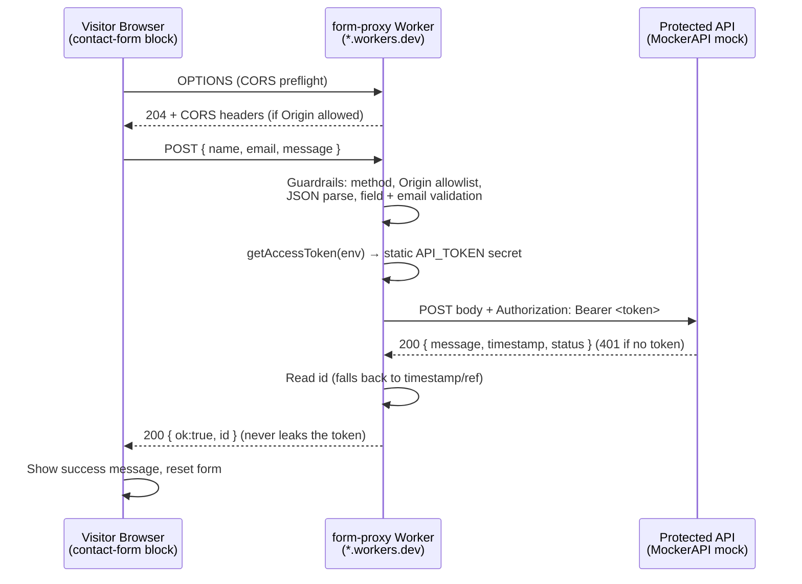

# Contact Form → Edge Worker → Authenticated API

This doc explains the **contact form submission** feature: what it is, how a
submission travels from the browser to a protected API and back, every design
decision behind it, the exact code changes made, how to test it, and what to
change if the Worker is ever moved to a different Cloudflare account.

---

## 1. What the feature is

A `contact-form` block collects Name / Email / Message and submits it to a
**Cloudflare Worker** (`form-proxy`). The Worker is a server-side "middleman"
that holds a secret API token, attaches it to the request, and calls a
**protected (Bearer-authenticated) API** on the visitor's behalf. The browser
never sees the token.

For this POC the protected API is a **MockerAPI** endpoint
(<https://mockerapi.com>) configured to require a Bearer token — enough to
prove the secure end-to-end flow without a real backend.

```
contact-form block (browser)   →   form-proxy Worker   →   authenticated API
        no secrets                   holds the token          (MockerAPI mock)
```

---

## 2. How a submission travels



### Step-by-step

1. The block POSTs `{name, email, message}` to the Worker URL — never to the
   API directly.
2. The Worker runs guardrails: must be `POST`, `Origin` must match the
   allowlist, body must be valid JSON, and all fields (plus a valid email) must
   be present. A hidden **honeypot** field in the block silently drops bots.
3. `getAccessToken()` returns the `API_TOKEN` secret directly (static-token
   mode — see decision D2). No OAuth exchange happens.
4. `callApi()` calls `API_URL` with `Authorization: Bearer <token>`.
5. The Worker returns a clean `{ ok:true, id }`. The token and any upstream
   internals are never exposed to the browser.

---

## 3. Decisions made

| # | Decision | Why |
| --- | --- | --- |
| D1 | **Bearer token** auth type on MockerAPI | Matches the `Authorization: Bearer` header the Worker already sends; simplest realistic auth. |
| D2 | **Static-token mode** in the Worker (no OAuth exchange) | MockerAPI issues one static token at endpoint creation — it has no `client_credentials` token server. `getAccessToken()` returns `env.API_TOKEN` when `USE_PLACEHOLDER="false"`. The original OAuth path is kept for future real APIs that need it. |
| D3 | **Self-chosen token** supplied at endpoint creation | MockerAPI did not auto-return a token in our tests, so we passed our own `token` value and control the secret. |
| D4 | **Fixed a real CORS/origin bug** | `ALLOWED_ORIGIN` was a `RegExp` compared with `===`/`!==` (string vs regex) → every request 403'd and the CORS header was always empty. Replaced with an `ALLOWED_ORIGINS` array matched via `.test()`. |
| D5 | **Added `http://localhost:3000`** to the allowlist | Enables local browser testing against the deployed Worker without extra config. |
| D6 | **Tolerant `id` parsing** in `callApi()` | The mock returns no `id` (only `message`/`timestamp`/`status`); we fall back to `timestamp` then a generated ref so the browser always gets a reference. |
| D7 | **Secret stored via `wrangler secret put`** | Keeps the token encrypted on Cloudflare, never in Git or page source. |
| D8 | **API URL committed in `wrangler.toml`, token kept as a secret** | The endpoint URL is not sensitive; only the token is. |

> **Note on data storage:** MockerAPI is a **mock** — it does not persist
> submissions. It ignores the posted body, returns a canned response, and only
> increments a hit counter. The Worker is stateless and stores nothing. To
> actually persist submissions, point `API_URL` at a real backend (or add a
> Cloudflare KV/D1 binding to the Worker).

---

## 4. Files involved / changes made

| File | Role | Change |
| --- | --- | --- |
| [workers/form-proxy/src/index.js](../workers/form-proxy/src/index.js) | The Worker (guardrails, auth, API call) | Fixed CORS origin matching (`ALLOWED_ORIGINS` + `isAllowedOrigin` using `.test()`), added `localhost:3000`, added static-token path in `getAccessToken()`, made `callApi()` id-parsing tolerant. |
| [workers/form-proxy/wrangler.toml](../workers/form-proxy/wrangler.toml) | Worker config (vars) | `USE_PLACEHOLDER="false"`, `API_URL` set to the MockerAPI endpoint. |
| [blocks/contact-form/contact-form.js](../blocks/contact-form/contact-form.js) | The block decorator | `DEFAULT_ENDPOINT` set to the deployed Worker URL. |
| [drafts/contact.plain.html](../drafts/contact.plain.html) | Local test page | New draft with the `contact-form` block wired to the Worker. |

Secrets / config **not** in Git:

| Name | Where | Purpose |
| --- | --- | --- |
| `API_TOKEN` | Cloudflare Worker secret (`wrangler secret put`) | Bearer token sent to the protected API. |

Current deployed values (POC):

- Worker URL: `https://form-proxy.form-proxy.workers.dev`
- `API_URL`: `https://free.mockerapi.com/mock/<endpoint-uuid>` (POST, Bearer-protected)

---

## 5. How to test it

### 5.1 Level 1 — Test the Worker directly (no site needed)

Proves the browser→Worker→API chain in isolation. Run in PowerShell:

```powershell
$w = 'https://form-proxy.form-proxy.workers.dev'

# Happy path (allowed origin + valid body) → expect 200 {"ok":true,"id":...}
Invoke-WebRequest -Uri $w -Method POST `
  -Headers @{Origin='http://localhost:3000'} `
  -ContentType 'application/json' `
  -Body '{"name":"Jane","email":"jane@example.com","message":"hello"}' `
  -UseBasicParsing | Select-Object -Expand Content

# Blocked origin → expect 403
try { Invoke-WebRequest -Uri $w -Method POST -Headers @{Origin='https://evil.com'} `
  -ContentType 'application/json' -Body '{}' -UseBasicParsing } catch { $_.Exception.Response.StatusCode.value__ }

# Invalid fields → expect 400
try { Invoke-WebRequest -Uri $w -Method POST -Headers @{Origin='http://localhost:3000'} `
  -ContentType 'application/json' -Body '{"name":"x"}' -UseBasicParsing } catch { $_.Exception.Response.StatusCode.value__ }
```

Pass = `200` with an `id`, then `403`, then `400`.

You can also confirm the API itself enforces the token — hitting `API_URL`
**without** the Bearer header returns `401`.

### 5.2 Level 2 — Test the form in the browser (local)

1. Start the dev server from the repo root, serving the draft page:

   ```powershell
   npx -y @adobe/aem-cli up --no-open --html-folder drafts
   ```

2. Open `http://localhost:3000/contact`.
3. Fill Name / Email / Message → **Send message** → expect the green success
   message.
4. DevTools → Network: the `form-proxy.form-proxy.workers.dev` POST should be
   `200`. Submit with an empty field first to see inline validation (no network
   call). The Origin here is `http://localhost:3000`, which the Worker allows.

### 5.3 Level 3 — Test on the AEM preview (real deployment)

1. Commit and push the changed files on your feature branch:

   ```powershell
   git add workers/form-proxy/src/index.js workers/form-proxy/wrangler.toml `
           blocks/contact-form/contact-form.js drafts/contact.plain.html
   git commit -m "Connect contact-form worker to authenticated MockerAPI endpoint"
   git push
   ```

2. Add the `contact-form` block to a content page (or preview the draft), then
   open the branch preview:

   ```
   https://<branch>--eds-universaleditor--asahu534.aem.page/<page>
   ```

3. Submit the form → success message. The Origin check passes because that host
   matches `ALLOWED_ORIGINS`.
4. Confirm upstream received the call: MockerAPI's **hit counter** increments.

---

## 6. Moving the Worker to another Cloudflare account

Everything below runs from `workers/form-proxy/`. Nothing about the block or the
API needs to change unless the Worker URL changes (it will).

1. **Authenticate to the new account:**

   ```powershell
   npx wrangler logout
   npx wrangler login          # sign in to the new account
   npx wrangler whoami         # confirm the new account/email
   ```

2. **Register a `workers.dev` subdomain** (first deploy prompts for one), or set
   a custom `name`/routes in `wrangler.toml` if using a custom domain.

3. **Re-create the secret** (secrets are per-account, never migrated):

   ```powershell
   npx wrangler secret put API_TOKEN
   ```

4. **Deploy:**

   ```powershell
   npx wrangler deploy
   ```

   Note the **new Worker URL** it prints (e.g.
   `https://form-proxy.<new-subdomain>.workers.dev`).

5. **Update the block endpoint** — set `DEFAULT_ENDPOINT` in
   [blocks/contact-form/contact-form.js](../blocks/contact-form/contact-form.js)
   to the new Worker URL (or override it per page via the block's first row).

6. **Update the origin allowlist if the site changed** — `ALLOWED_ORIGINS` in
   [workers/form-proxy/src/index.js](../workers/form-proxy/src/index.js) must
   match the site's real `*.aem.page` / `*.aem.live` origin (currently
   `--eds-universaleditor--asahu534`). Re-deploy after editing.

7. **Re-test** using Level 1–3 above against the new Worker URL.

### Quick checklist

| Item | Migrated automatically? | Action |
| --- | --- | --- |
| Worker code + `wrangler.toml` vars | ✅ (in Git) | `wrangler deploy` |
| `API_TOKEN` secret | ❌ | `wrangler secret put API_TOKEN` on new account |
| Worker URL | ❌ (new subdomain) | Update `DEFAULT_ENDPOINT` in the block |
| Origin allowlist | ✅ (in code) | Edit only if the site host changed |
| MockerAPI endpoint / token | ✅ (unchanged) | None, unless rotating the token |

---

## 7. Related

- MockerAPI docs: <https://mockerapi.com/docs>
- Cloudflare Workers / Wrangler: <https://developers.cloudflare.com/workers/>
- Worker README: [workers/form-proxy/README.md](../workers/form-proxy/README.md)
