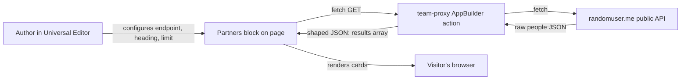

# Partners Block — How It Works (End to End)

This document explains every part of the Partners block: the files involved, where they
live, what data flows where, and which keys are (and aren't) required.

## ⚠️ Two things to know first

1. **Secrets are exposed.** `appbuilder/appbuilder/.env` contains a real-looking Adobe I/O
   Runtime credential (`AIO_runtime_auth`) plus tokens. That file says "must not be committed
   to source control," but it is present in the workspace. If this repo is pushed anywhere,
   rotate that credential. (The Partners flow itself needs none of these keys.)
2. **The block isn't registered yet.** `blocks/partners/_partners.json` exists, but the built
   `component-definition.json` and `component-models.json` do **not** contain `partners`. Run
   `npm run build:json` for it to appear in the Universal Editor. See "How to make it work" below.

---

## The big picture

The Partners block displays a grid of people cards (photo, name, location, email). The data
does **not** live in AEM — it is fetched at runtime from an **Adobe App Builder** serverless
action, which in turn proxies a public demo API.



---

## Part 1 — The EDS side (frontend)

Location: `eds-universalEditor/blocks/partners/`

### `partners.js` — the block logic

- **`readConfig(block)`** reads 3 rows the author entered:
  - Row 0 -> `endpoint` (defaults to the hard-coded `DEFAULT_ENDPOINT` at the top of the file)
  - Row 1 -> `heading`
  - Row 2 -> `limit` (0 = show all)
- **`decorate(block)`** (the default export EDS calls automatically):
  1. Renders the optional `<h2>` heading.
  2. `fetch(endpoint)` with `Accept: application/json`.
  3. Reads `json.results` (expects `{ results: [...] }`).
  4. Applies `limit` if > 0.
  5. Renders each person via `renderCard`, or a friendly message if empty / on error.
- **`renderCard(member)`** builds each card and expects these fields per member:
  - `member.name`, `member.title`, `member.email`, `member.picture`
  - `cleanUrl()` handles the case where picture comes as `[url](url)` markdown.
  - If the image fails, it falls back to **initials** in a circle.

### `partners.css`

Responsive card grid (1 col -> 2 -> 3 -> 4 as screen widens), circular avatars, hover lift.

### `_partners.json` — the Universal Editor model

Defines the 3 author-editable fields and their defaults:

| Field      | Default                                                                                          |
| ---------- | ------------------------------------------------------------------------------------------------ |
| `endpoint` | `https://291222-edsuniversaleditor-stage.adobeio-static.net/api/v1/web/appbuilder/team-proxy`    |
| `heading`  | `Our partners`                                                                                   |
| `limit`    | `0`                                                                                              |

---

## Part 2 — The AppBuilder side (backend)

The endpoint URL maps like this:

`https://291222-edsuniversaleditor-stage.adobeio-static.net/api/v1/web/appbuilder/team-proxy`
-> package `appbuilder`, action `team-proxy`.

### Config wiring — `appbuilder/appbuilder/app.config.yaml`

```yaml
team-proxy:
  function: actions/generic/index.js   # <-- the file that runs
  web: 'yes'
  annotations:
    require-adobe-auth: false           # <-- public, no key needed
    final: true
```

So the action file is actually `appbuilder/appbuilder/actions/generic/index.js` (named
`team-proxy` at deploy time).

### `generic/index.js` — the `team-proxy` action

- Fetches `https://randomuser.me/api/` (a public demo person generator).
- Accepts an optional `?results=N` query param (default 12, max 50).
- **`shapePerson(p)`** transforms each raw person into exactly what `partners.js` expects:
  ```js
  { name, title: "city, country", email, picture }
  ```
- Returns `{ count, results: [...] }` with a 5-minute cache header.
- Handles CORS preflight (`OPTIONS` -> 204). Adobe I/O auto-injects CORS headers.

### `utils.js`

Shared helpers (`errorResponse`, `stringParameters`, etc.) used for logging and error shaping.

---

## Part 3 — Keys / secrets

**Good news: the Partners flow needs ZERO keys.**

- `team-proxy` has `require-adobe-auth: false` and calls a public API. No auth, no token.

The keys in `.env` belong to the **other two actions**, not partners:

| Key                                                       | Used by                            | Status                   |
| --------------------------------------------------------- | ---------------------------------- | ------------------------ |
| `AIO_runtime_auth`, `AIO_runtime_namespace`, `AIO_runtime_apihost` | Deploying/running AppBuilder (`aio` CLI) | present            |
| `CRM_API_TOKEN`                                           | `form-submit` action               | present (demo value)     |
| `SLACK_WEBHOOK_URL`                                       | `publish-notifier` action          | present (placeholder)    |
| `SERVICE_API_KEY`                                         | (JWT service account)              | empty                    |

So for partners specifically: **nothing to add.**

---

## Part 4 — How to make it work / go live

1. **Register the block in Universal Editor** (currently missing). From `eds-universalEditor/`:
   ```
   npm run build:json
   ```
   This globs `blocks/*/_*.json` (see `models/_component-definition.json`) and regenerates
   `component-definition.json` + `component-models.json` to include `partners`.
2. **Deploy the action** (if not already live) from `appbuilder/appbuilder/`: `aio app deploy`.
3. In the Universal Editor, add the **Partners** block, keep or change the endpoint, set a
   heading and limit.

---

## File reference

| File                                                          | Role                                            |
| ------------------------------------------------------------- | ----------------------------------------------- |
| `eds-universalEditor/blocks/partners/partners.js`             | Block logic: config, fetch, render cards        |
| `eds-universalEditor/blocks/partners/partners.css`            | Responsive styling for the card grid            |
| `eds-universalEditor/blocks/partners/_partners.json`          | Universal Editor model (author fields)          |
| `eds-universalEditor/models/_component-definition.json`       | Globs block definitions into the UE registry    |
| `eds-universalEditor/component-definition.json`               | Built UE registry (must be rebuilt for partners)|
| `eds-universalEditor/component-models.json`                   | Built UE models (must be rebuilt for partners)  |
| `appbuilder/appbuilder/app.config.yaml`                       | Maps `team-proxy` -> `actions/generic/index.js` |
| `appbuilder/appbuilder/actions/generic/index.js`              | The `team-proxy` action (proxies randomuser.me) |
| `appbuilder/appbuilder/actions/utils.js`                      | Shared action helpers                           |
| `appbuilder/appbuilder/.env`                                  | Secrets for other actions (NOT partners)        |
