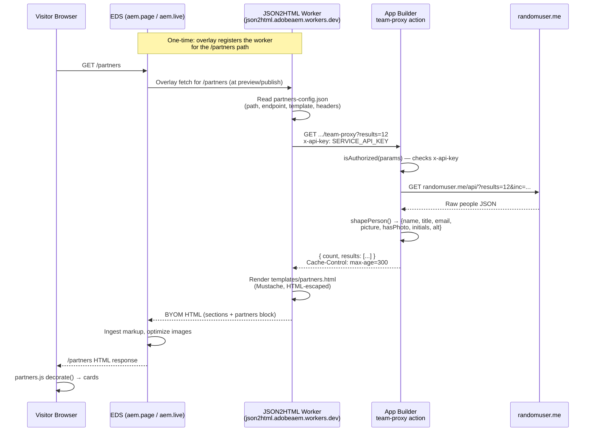

# Partners Component — End‑to‑End Documentation

This doc explains the **Partners** feature in this project: what it is, which
files are involved, exactly how a request travels from a visitor's browser to
the data source and back, and how to set up / run the App Builder side locally
so you can iterate on the backend action that powers it.

> Historical note: the earlier client‑side design is documented in
> [docs/PARTNERS-BLOCK.md](PARTNERS-BLOCK.md) and the migration decisions live in
> [docs/PARTNERS-JSON2HTML-MIGRATION.md](PARTNERS-JSON2HTML-MIGRATION.md). This
> document is the current source of truth.

---

## 1. What the Partners component is

A responsive grid of people cards (photo, name, location, email) served at the
`/partners` URL of the site. The page is **server‑rendered** at preview /
publish time by Adobe's official **JSON2HTML for Edge Delivery Services**
worker using a **Mustache** template (BYOM — Bring Your Own Markup). The
browser only receives already‑decorated markup; the block's JavaScript is a
pure decorator that turns the ingested rows into cards.

Data source: an Adobe **App Builder** serverless action named `team-proxy`
that proxies the public `randomuser.me` demo API and returns a shape that
matches the Mustache template.

---

## 2. Files involved

### Frontend (EDS)

| File | Role |
| --- | --- |
| [blocks/partners/partners.js](../blocks/partners/partners.js) | Decorates ingested rows into card DOM, adds photo→initials fallback. |
| [blocks/partners/partners.css](../blocks/partners/partners.css) | Responsive grid + card styling (1 → 2 → 3 → 4 columns). |
| [blocks/partners/_partners.json](../blocks/partners/_partners.json) | Universal Editor model (kept minimal — page is BYOM, not authored). |
| [templates/partners.html](../templates/partners.html) | Mustache template rendered by the JSON2HTML worker. Emits EDS block markup. |
| [tools/json2html/partners-config.json](../tools/json2html/partners-config.json) | Worker config: which path → which endpoint → which template + headers. |
| [drafts/partners.plain.html](../drafts/partners.plain.html) | Local draft used for local dev testing (via `--html-folder drafts`). |

### Backend (App Builder)

| File | Role |
| --- | --- |
| [appbuilder/app.config.yaml](../appbuilder/app.config.yaml) | Registers the `team-proxy` action and its runtime inputs (e.g. `SERVICE_API_KEY`). |
| [appbuilder/actions/generic/index.js](../appbuilder/actions/generic/index.js) | The `team-proxy` action itself: fetches upstream and shapes the JSON. |
| [appbuilder/actions/utils.js](../appbuilder/actions/utils.js) | Shared helpers (`errorResponse`, `isAuthorized`, `stringParameters`). |
| [appbuilder/.env.example](../appbuilder/.env.example) | Template for the runtime + secret values you must supply locally. |

---


## 3. How a request travels



### Step‑by‑step

1. **Visitor requests `/partners`** on the `.aem.page` (preview) or `.aem.live`
   (production) host.
2. **EDS delegates to the JSON2HTML worker** because a `overlay` mapping is
   registered for that path in the site's content‑source config (see the
   snippet in [docs/PARTNERS-JSON2HTML-MIGRATION.md](PARTNERS-JSON2HTML-MIGRATION.md)).
3. **The worker looks up `/partners`** in
   [tools/json2html/partners-config.json](../tools/json2html/partners-config.json)
   and finds:
   - `endpoint` → the App Builder `team-proxy` URL (with `?results=12`)
   - `template` → [templates/partners.html](../templates/partners.html)
   - `headers` → `X-API-Key` (shared secret injected by the worker)
4. **The worker calls `team-proxy`**. The action:
   - Validates the `x-api-key` header via
     [`isAuthorized`](../appbuilder/actions/utils.js).
   - Fetches `https://randomuser.me/api/?results=N&inc=name,email,picture,location`.
   - Runs [`shapePerson`](../appbuilder/actions/generic/index.js) on each entry
     to produce `{ name, title, email, picture, hasPhoto, initials, alt }` —
     precomputed so the logic‑less Mustache template needs zero computation.
   - Returns `{ count, results: [...] }` with a 5‑minute cache header.
5. **The worker renders the Mustache template**. `{{#results}} ... {{/results}}`
   iterates people; `{{#hasPhoto}}` / `{{^hasPhoto}}` switch between an
   `` and initials. All interpolation uses `{{ }}` so output is
   HTML‑escaped by default (no client sanitizer required).
6. **EDS ingests the returned HTML** as a normal page: sections, a `partners`
   block, rows and cells. Images referenced by `` are picked up and
   optimized.
7. **The response reaches the visitor.** In their browser, the small
   [blocks/partners/partners.js](../blocks/partners/partners.js) `decorate()`
   function runs on the `.partners` block, reads the 4 cells per row
   (photo, name, title, email), and builds the final `<ul class="partners-list">`
   with `.partners-item` cards. It also installs a captured `error` listener
   that swaps a broken photo for initials.

### What each field means downstream

`shapePerson()` output → Mustache placeholders → decorated DOM:

| Backend field | Template use | DOM outcome |
| --- | --- | --- |
| `picture` | `` inside `{{#hasPhoto}}` | `` in `.partners-photo` |
| `hasPhoto` / `initials` | `{{^hasPhoto}}{{initials}}{{/hasPhoto}}` | `.partners-photo-fallback` text |
| `alt` | `` | Accessible image label |
| `name` | Row cell 2 | `<h3 class="partners-name">` |
| `title` (city, country) | Row cell 3 | `<p class="partners-location">` |
| `email` | Row cell 4 | `<a class="partners-email" href="mailto:...">` |

### Secrets & auth summary

- The worker sends `X-API-Key: $SERVICE_API_KEY` to the action.
- The action requires that header (via `isAuthorized`) but does **not** require
  Adobe IMS auth (`require-adobe-auth: false` in
  [appbuilder/app.config.yaml](../appbuilder/app.config.yaml)).
- The upstream `randomuser.me` API is public and needs no key.

---

## 4. Setting up App Builder locally

Everything below runs from the `appbuilder/` folder inside this repo.

### 4.1 Prerequisites

- Node.js LTS (v20+ recommended) and npm
- Access to an Adobe Developer Console project + workspace that has the App
  Builder service enabled (ask a teammate if you don't have one)
- The `aio` CLI installed globally:

  ```bash
  npm install -g @adobe/aio-cli
  ```

### 4.2 First‑time setup

```bash
cd appbuilder
npm install
cp .env.example .env
```

Then log in and bind the local project to a workspace — this fills in most of
your `.env` automatically:

```bash
aio login          # opens the browser for SSO
aio app use        # pick Org → Project → Workspace
```

After `aio app use` you should have:

- `.aio` and `console.json` files (git‑ignored, machine‑local)
- Populated `AIO_runtime_auth` / `AIO_runtime_namespace` /
  `AIO_runtime_apihost` values in `.env`

Fill in the remaining secrets in `.env` (see
[appbuilder/.env.example](../appbuilder/.env.example)):

| Variable | Needed by | Where to get it |
| --- | --- | --- |
| `SERVICE_API_KEY` | `team-proxy` (this is the Partners flow) | Ask secrets owner. Must match the value the JSON2HTML worker config sends as `X-API-Key`. |
| `CRM_API_TOKEN` | `form-submit` action (unrelated to partners) | Secrets owner |
| `SLACK_WEBHOOK_URL` | `publish-notifier` action (unrelated to partners) | Secrets owner |

> **Never commit `.env`, `.aio`, or `console.json`.** They are already ignored.

### 4.3 Common commands

Run these from `appbuilder/`:

| Command | What it does |
| --- | --- |
| `aio app run` | UI served locally; actions are pushed to Runtime and served from there. Fastest inner loop for UI work. |
| `aio app dev` | UI **and** actions run locally, wired for VS Code debugging. |
| `aio app deploy` | Build and deploy the app (actions + web static) to your workspace on Adobe I/O Runtime. |
| `aio app undeploy` | Remove the deployed app from Runtime. |
| `aio app test` | Run unit tests. |
| `aio app test --e2e` | Run end‑to‑end tests. |

If you run `aio app run` without doing `aio app use` first you will hit:

```
Error: missing Adobe I/O Runtime namespace, did you set the AIO_RUNTIME_NAMESPACE environment variable?
```

That is the reminder to complete step 4.2.

### 4.4 Calling `team-proxy` directly (sanity check)

Once deployed to your workspace you can hit the action from a terminal — this
is the same URL the JSON2HTML worker calls:

```bash
curl -i \
  -H "x-api-key: $SERVICE_API_KEY" \
  "https://<your-namespace>.adobeio-static.net/api/v1/web/appbuilder/team-proxy?results=6"
```

Expected: `200 OK`, JSON body `{ "count": 6, "results": [ ... ] }`. Without
the header you should get `401 unauthorized`.

---

## 5. How to see your changes

You have three places to preview, depending on what you changed.

### 5.1 EDS block / template changes (fastest loop)

For work in
[blocks/partners/](../blocks/partners/) or
[templates/partners.html](../templates/partners.html):

1. From the repo root, start the AEM dev server:

   ```bash
   npx -y @adobe/aem-cli up --no-open --forward-browser-logs
   ```

2. Open `http://localhost:3000/partners`.

3. To preview local draft markup without hitting the JSON2HTML worker, start
   the server with the drafts folder:

   ```bash
   npx -y @adobe/aem-cli up --no-open --forward-browser-logs --html-folder drafts
   ```

   This serves [drafts/partners.plain.html](../drafts/partners.plain.html) so
   [blocks/partners/partners.js](../blocks/partners/partners.js) can be
   iterated against a stable, offline row structure.

4. Inspect what the backend is returning at any time:

   ```bash
   curl http://localhost:3000/partners
   curl http://localhost:3000/partners.plain.html
   ```

CSS / JS edits hot‑reload the browser. Model changes in
[blocks/partners/_partners.json](../blocks/partners/_partners.json) require
`npm run build:json` to rebuild `component-definition.json` and
`component-models.json`.

### 5.2 Backend (`team-proxy`) changes

For work in [appbuilder/actions/generic/index.js](../appbuilder/actions/generic/index.js):

1. `cd appbuilder && aio app dev` — runs the action locally with a stub
   endpoint printed in the console.
2. Call it directly with `curl` (see §4.4) to verify the JSON shape.
3. When happy, `aio app deploy` to push it to your workspace. The JSON2HTML
   worker will pick up new responses immediately (respecting the 5‑minute
   cache header, unless you bypass it or wait it out).

### 5.3 Preview in the real preview / production environments

Once your changes are pushed to a feature branch, EDS Code Sync builds the
matching preview URL:

- **Feature preview**: `https://<branch>--eds-universaleditor--asahu534.aem.page/partners`
- **Production preview**: `https://main--eds-universaleditor--asahu534.aem.page/partners`
- **Production live**: `https://main--eds-universaleditor--asahu534.aem.live/partners`

(Values from [fstab.yaml](../fstab.yaml).)

For the `/partners` page specifically, remember that the worker also needs to
be told about your branch. If you are testing on a branch, either:

- Re‑POST the worker config using your branch name in the URL
  (`.../config/asahu534/eds-universaleditor/<branch>`) with an admin token, or
- Merge to `main` where the config is already registered.

The full one‑time setup for the worker (overlay + POST config) is in
[docs/PARTNERS-JSON2HTML-MIGRATION.md § 5](PARTNERS-JSON2HTML-MIGRATION.md#5-one-time-setup-to-go-live-requires-an-aem-admin-token).

---

## 6. Troubleshooting cheatsheet

| Symptom | Likely cause | Fix |
| --- | --- | --- |
| `/partners` returns your local `drafts/partners.plain.html` unchanged | You started the dev server with `--html-folder drafts` | Restart without that flag, or edit the draft file |
| `401 unauthorized` from `team-proxy` | Missing / wrong `x-api-key` header | Ensure `SERVICE_API_KEY` in `.env` matches the value the JSON2HTML worker sends |
| `500 server error` from `team-proxy` | Upstream `randomuser.me` failed | Check action logs: `aio app logs`. Retry — it's a public demo API |
| Cards render but photos are all initials | Image URL failed to load, fallback fired | Check `picture` value in the action's JSON response; open URL directly |
| Block never shows up in Universal Editor | Not registered in the built aggregate files | Run `npm run build:json` from the repo root |
| Response looks stale after backend change | 5‑minute cache header on the action | Wait it out, or add a `?cachebust=` query param when testing directly |

---

## 7. Related docs
- Adobe: <https://www.aem.live/developer/json2html> and <https://www.aem.live/developer/byom>.
