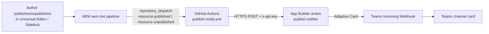

# Teams Publish Notifications

Automated Microsoft Teams notifications when a page is **published** or **unpublished**
on the Edge Delivery site, powered by AEM publish events → GitHub Actions → an Adobe
App Builder action → a Teams Incoming Webhook.

- Site: `main--eds-universaleditor--asahu534.aem.live`
- Code repo: `asahu534/eds-universalEditor` (default branch: `develop`)
- App Builder namespace: `291222-edsuniversaleditor-stage`

---

## 1. How it works (end‑to‑end flow)



1. An author publishes (or unpublishes) a page. Publishing always goes through the
   aem.live pipeline, regardless of the authoring tool (Universal Editor, Sidekick, DA).
2. AEM sends a GitHub [`repository_dispatch`](https://www.aem.live/developer/github-actions)
   event to the code repo: `resource-published` or `resource-unpublished`.
3. GitHub runs the workflow `.github/workflows/publish-notify.yml` (from the **default
   branch** — see the branch note in section 6).
4. The workflow makes an authenticated HTTPS call to the deployed `publish-notifier`
   App Builder action, passing the page path, publisher, and event type.
5. The action validates a shared secret, builds a Teams **Adaptive Card**, and POSTs it
   to the Teams Incoming Webhook.
6. The card appears in the Teams channel.

---

## 2. Components

| Component | Path / location | Purpose |
| --- | --- | --- |
| App Builder action | `appbuilder/actions/publish-events/index.js` | Builds and sends the Teams (and optional Slack) message. Secret‑gated. Deployed as `publish-notifier`. |
| Shared utilities | `appbuilder/actions/utils.js` | `isAuthorized` (constant‑time `x-api-key` check), `errorResponse`, `stringParameters` (redacts secrets in logs). |
| App config | `appbuilder/app.config.yaml` | Declares the `publish-notifier` action, its inputs, and `require-adobe-auth: false`. |
| Local secrets | `appbuilder/.env` (not committed) | `TEAMS_WEBHOOK_URL`, `SERVICE_API_KEY`, `SITE_LIVE_HOST`, `SLACK_WEBHOOK_URL`. |
| GitHub workflow | `.github/workflows/publish-notify.yml` | Listens for the AEM events and calls the action. |
| GitHub repo secret | Repo → Settings → Secrets → Actions | `SERVICE_API_KEY` (must equal the action's `SERVICE_API_KEY`). |
| Teams webhook | Power Automate "Workflows" on the channel | Receives the Adaptive Card and posts it. |

---

## 3. Data: what we get, and from where

### 3.1 From the AEM publish event (`client_payload`)
The `repository_dispatch` payload provides:

| Field | Example | Notes |
| --- | --- | --- |
| `path` | `/faq.md` | The published/unpublished resource path. |
| `user` | `aem-code-sync[bot]` | The **publisher** (who/what triggered the publish). |
| `timestamp` | `2026-09-10T09:00:00Z` | When the publish happened. |

Accessed in the workflow via `github.event.client_payload.*` and `github.event.action`
(the event type, e.g. `resource-published`).

### 3.2 Added by us (not from AEM)
| Field | Where set | Notes |
| --- | --- | --- |
| `priority` | Hardcoded `"normal"` in the workflow body | AEM does **not** send a priority; it's a static placeholder. |
| `action` label | `github.event.action` | The raw event type string, e.g. `resource-published`. |

### 3.3 Not available without an Admin token
The **human author** ("who wrote the doc") is **not** in the event — the `user` field is
the *publisher*, which can be a bot for code‑sync publishes. Resolving the real author
requires the AEM Admin API and a token (version‑history lookup:
`GET https://api.aem.live/{org}/sites/{site}/source{path}.html/.versions` →
`doc-last-modified-by`). See Adobe's reference
[`build-message.js`](https://github.com/adobe/helix-website/blob/main/tools/publish-notify/build-message.js).
This project intentionally does **not** use a token, so the card shows the publisher.

---

## 4. The App Builder action API (`publish-notifier`)

**Deployed URL**

```
https://291222-edsuniversaleditor-stage.adobeioruntime.net/api/v1/web/appbuilder/publish-notifier
```

**Method:** `POST` · **Content-Type:** `application/json`

**Auth:** header‑only shared secret. Send `x-api-key: <SERVICE_API_KEY>`. The action
compares it (constant‑time) to its configured `SERVICE_API_KEY`; a mismatch/missing key
returns `401`. (`require-adobe-auth` is `false` because external callers like the AEM
webhook/GitHub cannot send Adobe IMS tokens.)

**Request body**

| Field | Required | Example | Notes |
| --- | --- | --- | --- |
| `path` | yes | `/campaigns/summer-sale` | Page path. |
| `user` | no | `ajay` | Publisher; defaults to `unknown`. |
| `action` | no | `resource-published` | Event label; defaults to `publish`. |
| `priority` | no | `normal` | Free text; purely cosmetic. |

**Responses**

| Status | Body | Meaning |
| --- | --- | --- |
| `200` | `{ "notified": true, "path": "...", "teams": true }` | Card sent (`slack`/`teams` booleans per configured webhook). |
| `400` | `{ "error": "missing parameter(s) 'path'" }` or missing webhook URL | Bad input / no webhook configured. |
| `401` | `{ "error": "unauthorized" }` | Wrong/missing `x-api-key`. |
| `500` | `{ "error": "server error" }` | All configured webhooks failed. |

**Inputs** (from `.env` via `app.config.yaml`): `TEAMS_WEBHOOK_URL` (required for Teams),
`SLACK_WEBHOOK_URL` (optional), `SITE_LIVE_HOST` (optional, adds an "Open page" button),
`SERVICE_API_KEY` (the shared secret).

**Teams payload shape** produced by the action (Power Automate Workflows expects this):

```json
{
  "type": "message",
  "attachments": [
    {
      "contentType": "application/vnd.microsoft.card.adaptive",
      "content": { "type": "AdaptiveCard", "version": "1.4", "body": [ /* ... */ ] }
    }
  ]
}
```

---

## 5. The Teams webhook

Created via **Power Automate "Workflows"** on the target channel → template
**"Send webhook alerts to a channel"**. The generated HTTP POST URL is stored as
`TEAMS_WEBHOOK_URL` in `appbuilder/.env`.

> The URL contains a signature (`?...&sig=`) and **is** a credential — treat it as a
> secret and rotate it if exposed.

---

## 6. The GitHub workflow

File: `.github/workflows/publish-notify.yml`

**Triggers**

```yaml
on:
  repository_dispatch:            # real AEM events
    types:
      - resource-published
      - resource-published-native
      - resource-unpublished
      - resource-unpublished-native
  push:                          # for testing the workflow on these branches
    branches: [main, develop, feature/msteams-notification]
```

**Default‑branch rule (important):** per
[GitHub's docs](https://docs.github.com/en/actions/writing-workflows/choosing-when-your-workflow-runs/events-that-trigger-workflows#repository_dispatch),
`repository_dispatch` **only triggers a run if the workflow file exists on the default
branch.** This repo's default branch is **`develop`**, so the workflow must live on
`develop` for real AEM events to fire it. The `branches` list under `push` does **not**
change that — it only lets you test the workflow by pushing to those branches.

**The step** reads the event payload (with fallbacks for push‑test runs) and calls the
action:

```yaml
env:
  PUBLISH_PATH: ${{ github.event.client_payload.path || '/ci-test-page' }}
  PUBLISHER:    ${{ github.event.client_payload.user || github.actor }}
  EVENT_TYPE:   ${{ github.event.action || github.event_name }}
  ACTION_URL:   https://291222-edsuniversaleditor-stage.adobeioruntime.net/api/v1/web/appbuilder/publish-notifier
  SERVICE_API_KEY: ${{ secrets.SERVICE_API_KEY }}
```

**Automatic steps:** GitHub adds `Set up job` and `Complete job` around your steps
automatically; only `Notify Teams via App Builder action` is defined by us.

---

## 7. Configuration checklist

1. `appbuilder/.env` contains `TEAMS_WEBHOOK_URL`, `SERVICE_API_KEY`, and optionally
   `SITE_LIVE_HOST` (e.g. `main--eds-universaleditor--asahu534.aem.live`).
2. Deploy the action: `cd appbuilder && aio app deploy`.
3. Add a GitHub **repo secret** `SERVICE_API_KEY` equal to the action's value.
4. Commit `.github/workflows/publish-notify.yml` to the **default branch (`develop`)**.

---

## 8. Testing with curl

> Examples use bash syntax. On Windows PowerShell, `curl` is an alias for
> `Invoke-WebRequest` — use `curl.exe`, and because PowerShell mangles inline JSON,
> write the body to a file **without a BOM** (`[IO.File]::WriteAllText(...)`) and pass
> `--data "@file"`.

### 8.1 Test the deployed action directly (isolates the Teams step)

```bash
curl -sS -X POST \
  "https://291222-edsuniversaleditor-stage.adobeioruntime.net/api/v1/web/appbuilder/publish-notifier" \
  -H "content-type: application/json" \
  -H "x-api-key: <SERVICE_API_KEY>" \
  -d '{"path":"/campaigns/summer-sale","user":"ajay","action":"resource-published"}' \
  -w "\nHTTP %{http_code}\n"
# Expect: {"notified":true,"path":"/campaigns/summer-sale","teams":true}  HTTP 200
```

### 8.2 Test the full chain by simulating the AEM event

Sends the same `repository_dispatch` event AEM would, triggering the workflow. Needs a
GitHub token (classic PAT with `repo` scope, or fine‑grained with Contents: read/write).

```bash
curl -sS -X POST \
  "https://api.github.com/repos/asahu534/eds-universalEditor/dispatches" \
  -H "Accept: application/vnd.github+json" \
  -H "Authorization: Bearer <GITHUB_PAT>" \
  -H "X-GitHub-Api-Version: 2022-11-28" \
  -d '{"event_type":"resource-published","client_payload":{"path":"/campaigns/summer-sale","user":"ajay","timestamp":"2026-09-10T09:00:00Z"}}' \
  -w "\nHTTP %{http_code}\n"
# Expect: HTTP 204 -> a "Publish Notify" run in GitHub Actions -> a Teams card
```

Unpublish variant: set `"event_type":"resource-unpublished"`.

### 8.3 PowerShell helper (repeatable)

```powershell
$env:GH_PAT = '<GITHUB_PAT>'   # set once per session

function Send-Publish {
  param(
    [string]$Path = '/campaigns/summer-sale',
    [ValidateSet('resource-published','resource-unpublished')]
    [string]$Event = 'resource-published',
    [string]$User = 'ajay'
  )
  $dispatch = 'https://api.github.com/repos/asahu534/eds-universalEditor/dispatches'
  $payload = @{
    event_type    = $Event
    client_payload = @{ path = $Path; user = $User; timestamp = (Get-Date).ToString('o') }
  } | ConvertTo-Json -Compress
  [IO.File]::WriteAllText("$env:TEMP\dispatch.json", $payload)
  curl.exe -sS -X POST $dispatch `
    -H "Accept: application/vnd.github+json" `
    -H "Authorization: Bearer $env:GH_PAT" `
    -H "X-GitHub-Api-Version: 2022-11-28" `
    --data "@$env:TEMP\dispatch.json" -w "`nHTTP %{http_code}`n"
}

# Usage:
Send-Publish "/campaigns/summer-sale"
Send-Publish "/partners" -Event resource-unpublished
```

### 8.4 Unit tests

```bash
cd appbuilder
npx jest test/publish-events.test.js test/utils.test.js
```

---

## 9. Known limitations

- **Publisher vs author:** the event's `user` is the *publisher* and may be
  `aem-code-sync[bot]` for code‑sync publishes. The real human author is not in the
  event; resolving it needs an Admin token (see section 3.3 and Adobe's reference code).
- **Priority is cosmetic:** AEM sends no priority; the card's value is a static
  `"normal"`.
- **Default branch only:** real AEM events only trigger the workflow copy on the default
  branch (`develop`).
- **No token / no polling:** by design this uses the event push only; there is no Admin
  API token and no `query-index.json` polling.

---

## 10. Troubleshooting

| Symptom | Likely cause / fix |
| --- | --- |
| `curl` dispatch returns `204` but no Actions run | Workflow not on the default branch (`develop`), or event type not in the workflow `types:`. |
| Actions run shows the step `401` | GitHub secret `SERVICE_API_KEY` ≠ the deployed action's `SERVICE_API_KEY`. |
| Actions run shows `400` | Deployed action missing `TEAMS_WEBHOOK_URL`; re‑deploy `appbuilder`. |
| `200` but no Teams card | Teams Workflow rejected the Adaptive Card shape; try a plain `{ "text": "..." }` body. |
| GitHub dispatch `400 "Problems parsing JSON"` | JSON quoting or a UTF‑8 BOM (PowerShell). Write the body without a BOM. |

---

## 11. References

- AEM publish events → GitHub Actions: https://www.aem.live/developer/github-actions
- GitHub `repository_dispatch` (default‑branch rule): https://docs.github.com/en/actions/writing-workflows/choosing-when-your-workflow-runs/events-that-trigger-workflows#repository_dispatch
- Adobe reference workflow: https://github.com/adobe/helix-website/blob/main/.github/workflows/log-publish.yml
- Adobe author lookup (`build-message.js`): https://github.com/adobe/helix-website/blob/main/tools/publish-notify/build-message.js
- AEM Admin API: https://www.aem.live/docs/admin.html
